# TFM
Generation of synthetic MRI images using  lab2im for automatic classification of brain tissues. 
---
**Abstract**

The present work focuses on the generation of realistic synthetic magnetic resonance imaging (MRI) data using lab2im [1], with the goal of enhancing the automatic classification of brain tissues. Specifically, segmentation maps of gray matter (GM), white matter (WM), and cerebrospinal fluid (CSF) are employed as structural inputs to generate anatomically consistent MRI volumes.

The proposed workflow establishes an end-to-end preprocessing and synthetic image generation pipeline.Original MRI datasets obtained from OpenNeuro are standardized in resolution
and contrast using SynthSR [2], followed by skull-stripping with SynthStrip [3] to remove non-brain tissues. Tissue segmentation is then performed with SynthSeg [1], producing high-quality GM, WM, and CSF masks under variable contrast conditions. These masks serve as input to lab2im, a probabilistic generative model based on Gaussian Mixture Models (GMMs) that synthesizes new MRI volumes with realistic intensity distributions and spatial variations. To enrich the dataset, spatial deformations and intensity-based augmentations are applied to the synthetic images, improving diversity and robustness. The final dataset, composed of real and synthetic MRI images with corresponding labels, is used to train deep learning models, for tissue classification.

# Integrated Pipeline for Brain Tissue Segmentation Using Synthetic Data

## 1. Image Harmonization and Preprocessing

All MRI volumes are first standardized to ensure spatial and intensity consistency across subjects.

### Contrast Harmonization with SynthSR

**SynthSR [2]** is applied to all T1-weighted images to map them into a common high-resolution, contrast-harmonized space. This step serves as the unified entry point of the pipeline and reduces variability due to acquisition differences.

*SynthSR maps heterogeneous T1-weighted MRI volumes into a common high-resolution and contrast-normalized space, reducing inter-subject variability.*
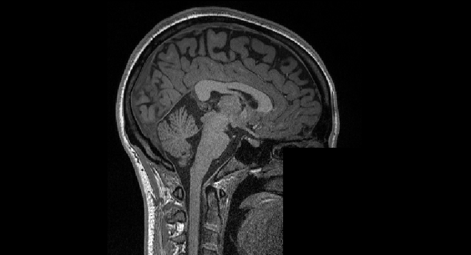
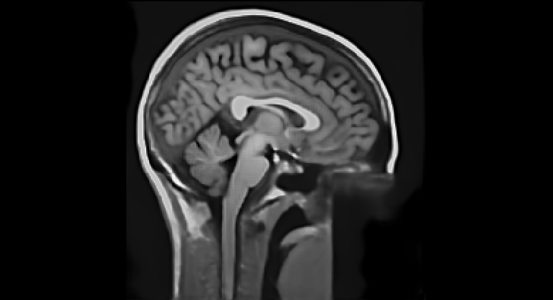

### Skull-Stripping

Two state-of-the-art brain extraction methods are applied independently:

- **SynthStrip [3]**
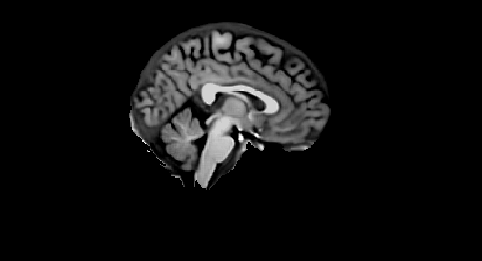

- **HD-Bet [4]**
Isensee, F., Schell, M., Tursunova, I., Brugnara, G., Bonekamp, D., Neuberger, U.,  
Wick, A., Schlemmer, H. P., Heiland, S., Wick, W., Bendszus, M.,  
Maier-Hein, K. H., & Kickingereder, P. (2019).  
*Automated brain extraction of multi-sequence MRI using artificial neural networks.* 

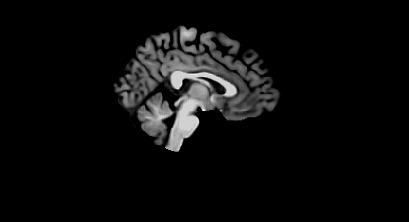

This creates parallel preprocessing branches that allow direct comparison of skull-stripping strategies.

### Intensity Normalization and Cropping

After skull-stripping, images undergo:

- intensity normalization
- automatic bounding-box computation
- cropping to center image

This ensures consistent spatial support across subjects.

---

## 2. Tissue Segmentation

Each preprocessed image is segmented using four different tools:

- **FastSurfer [6]**
    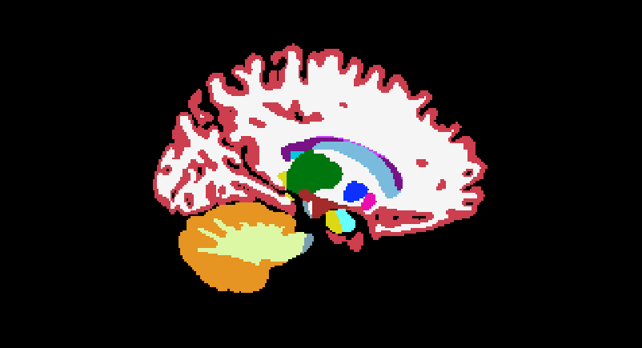
    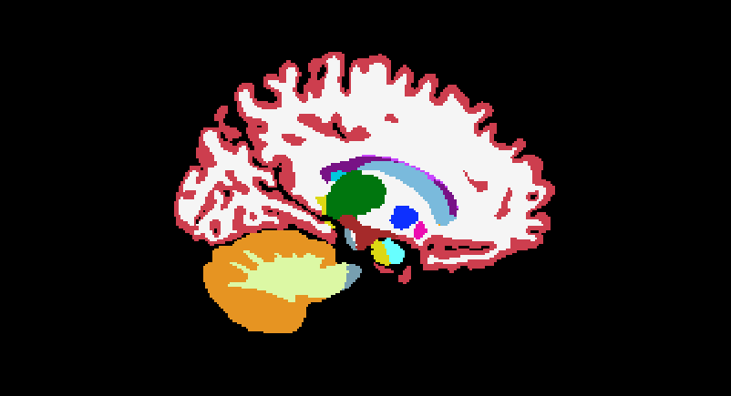
- **FSL FAST [7]**
    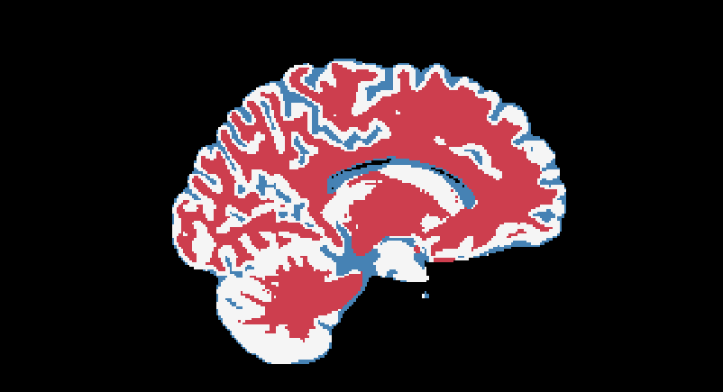
    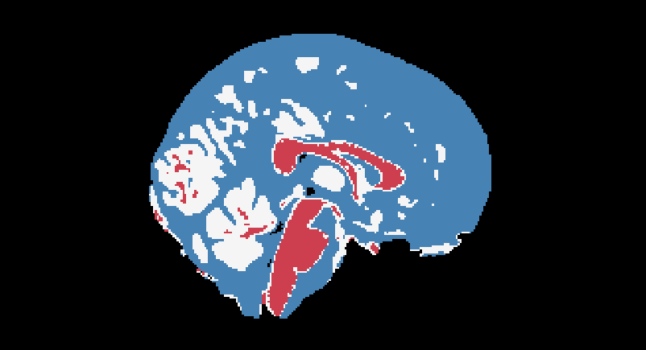
- **SAMSEG [1]**
    
    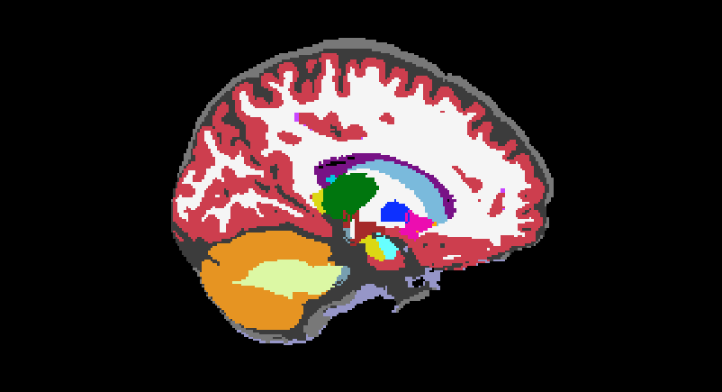
- **SynthSeg [1]**
    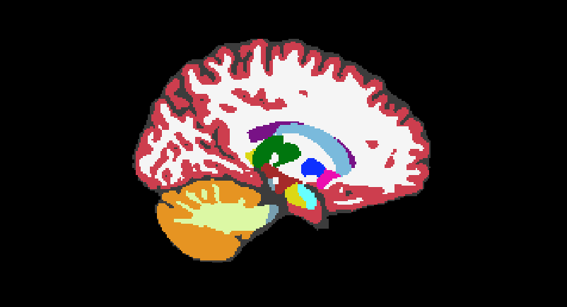
    


---

## 3. Synthetic Data Generation and Label Harmonization

Synthetic MRI images are generated from the simplified tissue maps using **lab2im** [1].


### Slice or 2DImage Synthesis

Lab2im generates anatomically plausible MRI images by sampling tissue-specific intensity distributions and applying spatial deformations.

### Data Augmentation

To increase realism and variability, the following transformations are applied:

- **Random Spatial Deformations:** Geometric modifications are applied to the images, such as local displacements or stretching of brain regions. This simulates anatomical variability between subjects and encourages the model to generalize beyond the specific shapes of the original data
- intensity augmentation
- Gaussian blur
- bias field corruption
- random flipping

### 2D Slice Extraction

From each synthesized volume, the central axial slice is extracted, padded to **256 × 256**, and saved as PNG. These slices constitute the final training and test datasets.

Each combination of **(segmentation method × skull-stripping method)** results in a distinct synthetic dataset.

At this point labels are also remapped to have only 4 possible values {0: background, 1: GM, 2: WM, 3: CSF}

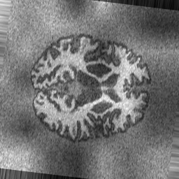


Labels are remapped to have only four possible values: 0: background, 1: GM, 2: WM, 3: CSF}. This harmonization ensures fair comparison across segmentation methods, which originally produce heterogeneous anatomical label sets (except for FSL FAST, that only switches GM labels with CSF labels for consistency).

To remap this labels the following information has been used!
- [FreeSurferColorLUT](https://surfer.nmr.mgh.harvard.edu/fswiki/FsTutorial/AnatomicalROI/FreeSurferColorLUT)
- [freesurfer mail archive](https://www.mail-archive.com/freesurfer@nmr.mgh.harvard.edu/msg67731.html)


---

## 4. Model Training and Evaluation

### Model

**nnUNet [5]** is used to train 2D tissue segmentation models on each synthetic dataset.

### Self-Configuring Framework

nnUNet automatically adapts its architecture and training strategy to the data, enabling fair comparison without manual hyperparameter tuning.

### Evaluation

Performance is assessed using Dice similarity coefficients for **GM**, **WM**, and **CSF**, allowing analysis of:

- overall segmentation quality
- tissue-specific failure modes
- robustness across preprocessing strategies


## Scripts & Env
There are 6 scripts (.sh and .py) in the main folder:
- ``workflow.sh`` (main workflow - ``WSL``)
- ``functions.sh`` (helper for ``workflow.sh``)
- ``calculate_bbox.py`` (helper for ``workflow.sh``)
- ``crop_bbox.py`` (helper for ``workflow.sh``)
- ``lab2im_generate.py`` (image synthesis by ``lab2im``, important run after ``workflow.sh``)
- ``train_eval_test_nnunet.py`` (train and evaluation by ``nnUnet`` , important run after ``lab2im_generate.py``)

There are 4 envs placed on a folder called envs:
- ``environment_tfm-fastsurfer`` (for ``workflow.sh`` and related ``WSL``)
- ``environment_tfm-lab2im`` (for ``lab2im_generate.py``)
- ``environment_tfm_nnunet`` (for ``train_eval_test_nnunet.py``)
- ``environment_tfm-analytics`` (for ``analitycs.ipynb``)

Final analysis can be found on ``analitycs.ipynb``


## Outputs

By ``worflow.sh``
```
- SR: Super-resolution made by SynthSR
  - SynthSR
- STRIP: Skull-stripping (hdbet or synthseg depending on the user selection) and manual normalization (crop)
    - hdbet
    - synthseg
- SEG: Segmentation (FastSufer, FSLFast, SyntSeg or SamSeg depending on the user selection)
    - FastSufer
    - FSLFast
    - SyntSeg
    - SamSeg
```

By ``lab2im_generate.py``
```
- SYNTH: Contains the synthetic images generated by lab2im separated by segmenter, stripper and sub.
    - train
        - ...
    - test
        - ...
```

By ``train_eval_test_nnunet.py``
```     
- nnunet
    - preprocessed
    - raw_data
    - results
```

Outputs are not facilitated as they are too huge to be posted on github.

### Notes:
``lab2im_generate.py`` the number of synthetic images generated per case is controlled by the variables ``n_images_train`` and ``n_images_test``, as well as the constant ``N_IMAGES_FSLFAST_HDBET``. These values are defined in the ``if __name__ == "__main__":`` block and can be easily modified by the user to change the size of the training or testing datasets.

Furthermore, the script contains a specific workaround for the FSLFast tool when paired with the hdbet stripper:

**workaround problematic case**
```
if tool == "FSLFast" and stripper == "hdbet" and (case in ["sub-01", "sub-04"]):
    continue
```

This conditional statement explicitly skips the image generation process for the ``FSLFast/hdbet`` combination on subjects ``sub-01`` (in the ``TRAIN`` split) and ``sub-04`` (in ``TEST`` splits). This is implemented to bypass issues where the segmentation step failed or produced unusable results for these specific cases, thus preventing subsequent errors during the synthetic image generation process.

### Image Configuration

- **format:** .png
- **size:** 256x256
- **normalized:** true
- **amount_synthetics:** all (660 per case generated by lab2im {600: train and validation, 60: test})
- **labels:** {0: background, 1: GM, 2: WM, 3: CSF}

### Notes:
The total number of synthetic images generated (`amount_synthetics`) is currently **limited** and lower than initially planned for a comprehensive train/validation split.

This limitation arose primarily due to several **technical and environmental challenges**:

1.  **Version and Compatibility Errors:** Significant time was spent resolving complex versioning conflicts and compatibility issues involving Python libraries (e.g., TensorFlow, PyTorch, CUDA) and the specific GPU hardware used for accelerated processing.
2.  **Extended Development Time:** These technical hurdles, combined with minor developmental setbacks, resulted in considerable delays to the project timeline.

As this task is highly time-consuming, the final dataset size had to be constrained to meet the project deadline. However, the existing dataset still follows the structured methodology derived from the multi-tool workflow.

## Conclusions

This section presents the results obtained from the experiments and provides a brief interpretation of the observed behavior.

### nnUnnet Datasets (Generated by lab2im) - Dice per tissue

The following table reports the Dice scores obtained for each tissue (Gray Matter, White Matter, and Cerebrospinal Fluid) across the different nnUet datasets generated using lab2im.

|  DatasetID  | dice_GM | dice_WM | dice_CSF |
| ----------- | ------- | ------- | -------- |
|  **Dataset001** | 0.501   | 0.360   | 0.109    |
|  **Dataset002** | 0.496   | 0.350   | 0.084    |
|  **Dataset003** | 0.449   | 0.545   | 0.118    |
|  **Dataset004** | 0.475   | **0.574**   | 0.145    |
|  **Dataset005** | **0.636**   | 0.302   | **0.205**    |
|  **Dataset006** | 0.613   | 0.256   | 0.137    |
|  **Dataset007** | 0.616   | 0.373   | 0.139    |
|  **Dataset008** | 0.612   | 0.371   | 0.127    |


---
### Dice per Dataset
The mean Dice score is computed as the unweighted average of the tissue-wise Dice scores:
dice_mean = (dice_GM + dice_WM + dice_CSF) / 3

Based on the computed mean Dice score, the datasets are ranked as follows:

- **Dataset004 – FSLFast + synthstrip** → **0.398** 
- **Dataset005 – Samseg + hdbet** → 0.381
- **Dataset007 – SynthSeg + hdbet** → 0.376
- **Dataset003 – FSLFast + hdbet** → 0.371 
- **Dataset008 – SynthSeg + synthstrip** → 0.370
- **Dataset006 – Samseg + synthstrip** → 0.335  
- **Dataset001 – FastSurfer + hdbet** → 0.323  
- **Dataset002 – FastSurfer + synthstrip** → 0.310  

---

The best overall combination is **FSLFast with synthstrip**, suggesting that FSLFast benefits from a more consistent and conservative skull-stripping strategy.

### Effect of skull-stripping (Dice per Dataset)

Comparing `hdbet` vs `synthstrip` within each segmenter:

- **FSLFast**:  
  - Clear improvement with **synthstrip** (0.398 vs 0.371).
- **Samseg**:  
  - Better performance with **hdbet** (0.381 vs 0.335).
- **SynthSeg**:  
  - Minor differences, with a slight advantage for **hdbet**.
- **FastSurfer**:  
  - Lowest Dice scores overall, with a small advantage for **hdbet**.

Apparently at this point there is no universally optimal skull-stripping method; its impact strongly depends on the chosen segmenter.

---

### Tissue-wise Dice analysis (labels)

Dice scores per tissue (ordered by dataset ID's):

### Gray Matter (GM)
- Best values are observed in **Datasets 5–8**, mainly from **SynthSeg and Samseg**.
- GM reaches relatively high Dice values (up to ~0.63).

### White Matter (WM)
- Best performance is observed in **FSLFast + hdbet/synthstrip** (Datasets 3 and 4).
- WM appears to be the most stable tissue across several segmenters.

### Cerebrospinal Fluid (CSF)
- Dice scores are consistently low across all methods.
- CSF remains the **most challenging tissue to segment**.

Performance is not homogeneous across tissues; GM and WM are segmented more reliably than CSF. This can largely be explained by class imbalance, since CSF represents a smaller volumetric fraction of the brain and is therefore underrepresented during training. Future improvements could involve increasing the number of training cases or adopting targeted slice selection strategies that emphasize regions with higher CSF content.

---

### Segmenter-wise Analysis of Mean ROI Intensities

**ROI per case/segmenter/stripper:**

| segmenter  | stripper   | sub    | seg_file                 | mean_GM   | mean_WM   | mean_CSF  |
| ---------- | ---------- | ------ | ------------------------ | --------- | --------- | --------- |
| **FastSurfer** | **hdbet**      | **sub-01** | aseg.auto_noCCseg.nii.gz | 85.945671 | 77.378319 | 88.244629 |
| **FastSurfer** | **synthstrip** | **sub-01** | aseg.auto_noCCseg.nii.gz | 85.270798 | 75.803131 | 89.533508 |
| **FSLFast** | **hdbet** | **sub-01** | sub-01_pveseg.nii.gz     | *NaN*       | *NaN*       | 62.156300 |
| **FSLFast** | **synthstrip** | **sub-01** | sub-01_pveseg.nii.gz     | 77.387672 | 61.912033 | 50.177635 |
| **Samseg** | **hdbet** | **sub-01** | seg.nii.gz               | 65.301186 | 81.511414 | 59.285332 |
| **Samseg** | **synthstrip** | **sub-01** | seg.nii.gz               | 63.049953 | 80.320068 | 54.225243 |
| **SynthSeg** | **hdbet** | **sub-01** | sub-01_pveseg.nii.gz     | 55.576847 | 73.492195 | 49.827679 |
| **SynthSeg** | **synthstrip** | **sub-01** | sub-01_pveseg.nii.gz     | 60.531155 | 77.269638 | 50.734146 |
| **FastSurfer** | **hdbet** | **sub-02** | aseg.auto_noCCseg.nii.gz | 81.830772 | 72.972580 | 81.017235 |
| **FastSurfer** | **synthstrip** | **sub-02** | aseg.auto_noCCseg.nii.gz | 82.749702 | 72.858444 | 82.949371 |
| **FSLFast** | **hdbet** | **sub-02** | sub-02_pveseg.nii.gz     | 73.917000 | 57.921856 | 57.057392 |
| **FSLFast** | **synthstrip** | **sub-02** | sub-02_pveseg.nii.gz     | 77.940163 | 62.545029 | 51.031929 |
| **Samseg** | **hdbet** | **sub-02** | seg.nii.gz               | 61.171692 | 76.526024 | 54.397900 |
| **Samseg** | **synthstrip** | **sub-02** | seg.nii.gz               | 63.963806 | 80.081566 | 53.786694 |
| **SynthSeg** | **hdbet** | **sub-02** | sub-02_pveseg.nii.gz     | 58.099537 | 74.568764 | 51.183895 |
| **SynthSeg** | **synthstrip** | **sub-02** | sub-02_pveseg.nii.gz     | 61.233288 | 76.989410 | 50.140038 |
| **FastSurfer** | **hdbet** | **sub-03** | aseg.auto_noCCseg.nii.gz | 83.537407 | 73.528404 | 81.303360 |
| **FastSurfer** | **synthstrip** | **sub-03** | aseg.auto_noCCseg.nii.gz | 83.931946 | 73.475296 | 82.289078 |
| **FSLFast** | **hdbet** | **sub-03** | sub-03_pveseg.nii.gz     | 76.355240 | 57.675964 | 54.181438 |
| **FSLFast** | **synthstrip** | **sub-03** | sub-03_pveseg.nii.gz     | 77.385719 | 59.630524 | 49.640144 |
| **Samseg** | **hdbet** | **sub-03** | seg.nii.gz               | 61.457996 | 78.609268 | 55.532162 |
| **Samseg** | **synthstrip** | **sub-03** | seg.nii.gz               | 61.798599 | 79.548584 | 52.847225 |
| **SynthSeg** | **hdbet** | **sub-03** | sub-03_pveseg.nii.gz     | 56.294952 | 74.923424 | 49.990108 |
| **SynthSeg** | **synthstrip** | **sub-03** | sub-03_pveseg.nii.gz     | 59.216652 | 76.838509 | 48.974487 |
| **FastSurfer** | **hdbet** | **sub-04** | aseg.auto_noCCseg.nii.gz | 83.332016 | 73.066544 | 86.081192 |
| **FastSurfer** | **synthstrip** | **sub-04** | aseg.auto_noCCseg.nii.gz | 83.290604 | 72.941650 | **87.039459** |
| **FSLFast** | **hdbet** | **sub-04** | sub-04_pveseg.nii.gz     | *NaN*       | *NaN*       | 62.701534 |
| **FSLFast** | **synthstrip** | **sub-04** | sub-04_pveseg.nii.gz     | 78.229111 | 61.790482 | 49.602345 |
| **Samseg** | **hdbet** | **sub-04** | seg.nii.gz               | 67.115402 | 82.655647 | 56.609501 |
| **Samseg** | **synthstrip** | **sub-04** | seg.nii.gz               | 65.645035 | **85.031433** | 54.348522 |
| **SynthSeg** | **hdbet** | **sub-04** | sub-04_pveseg.nii.gz     | 56.089741 | 74.100533 | 47.971100 |
| **SynthSeg** | **synthstrip** | **sub-04** | sub-04_pveseg.nii.gz     | 59.814007 | 76.376869 | 48.264122 |
| **FastSurfer** | **hdbet** | **sub-05** | aseg.auto_noCCseg.nii.gz | **84.152672** | 74.136925 | 81.831535 |
| **FastSurfer** | **synthstrip** | **sub-05** | aseg.auto_noCCseg.nii.gz | 84.153122 | 74.251419 | 82.511169 |
| **FSLFast** | **hdbet** | **sub-05** | sub-05_pveseg.nii.gz     | 76.452675 | 60.418682 | 54.822655 |
| **FSLFast** | **synthstrip** | **sub-05** | sub-05_pveseg.nii.gz     | 76.912674 | 60.843899 | 50.426552 |
| **Samseg** | **hdbet** | **sub-05** | seg.nii.gz               | 62.117195 | 77.780563 | 56.208004 |
| **Samseg** | **synthstrip** | **sub-05** | seg.nii.gz               | 62.205933 | 78.501358 | 53.193222 |
| **SynthSeg** | **hdbet** | **sub-05** | sub-05_pveseg.nii.gz     | 57.550533 | 74.573082 | 51.803703 |
| **SynthSeg** | **synthstrip** | **sub-05** | sub-05_pveseg.nii.gz     | 59.877983 | 75.919678 | 50.244995 |


**ROI per segmenter/stripper:**

| segmenter  | stripper   | mean_GM | mean_WM | mean_CSF | dice_mean |
| ---------- | ---------- | ------- | ------- | -------- | --------- |
| **FastSurfer** | **hdbet**      | **83.77**   | 74.20   | 83.39    | 0.8119    |
| **FastSurfer** | **synthstrip** | 82.97   | 74.13   | **84.06**    | **0.8165**    |
| **FSLFast**    | **hdbet**      | 74.15   | 61.25   | 57.59    | 0.4643    |
| **FSLFast**    | **synthstrip** | 77.38   | 61.91   | 50.18    | 0.3962    |
| **Samseg**     | **hdbet**      | 63.70   | 78.16   | 56.22    | 0.3979    |
| **Samseg**     | **synthstrip** | 63.54   | **78.43**   | 53.88    | 0.3890    |
| **SynthSeg**   | **hdbet**      | 56.32   | 74.31   | 50.99    | 0.3775    |
| **SynthSeg**   | **synthstrip** | 60.54   | 76.99   | 51.98    | 0.3968    |


**ROI per segmenter:**

| Segmenter   | GM   | WM   | CSF  |
|------------|------|------|------|
| **FastSurfer** | **83.82** | 74.04 | **84.28** |
| **FSLFast**    | 76.82 | 60.34 | 54.18 |
| **Samseg**     | 63.38 | **80.06** | 55.04 |
| **SynthSeg**   | 58.43 | 75.51 | 49.91 |

**Observations:**
- **FastSurfer**:
  - Clearly dominates in **GM and CSF**.
- **Samseg**:
  - Achieves the highest mean values in **WM**.
- **SynthSeg**:
  - More balanced behavior, but lower overall contrast.
- **FSLFast**:
    - Intermediate behavior. Important note on FSLFast + hdbet results:
        - Some NaN values observed in GM and WM for certain subjects.This likely indicates failure or missing output in segmentation when combined with hdbet skull-stripping.

---

### Top-performing cases by tissue

**Top 5 GM**
- Entirely dominated by **FastSurfer**.
- High consistency across subjects (`sub-01`, `sub-03`, `sub-05`).

**Top 5 WM**
- Clearly dominated by **Samseg**, especially for `sub-04` and `sub-01`.

**Top 5 CSF**
- Again, **FastSurfer** achieves the highest values (`sub-01`, `sub-02`, `sub-04`).

**FastSurfer emerges as the most consistent segmenter**, achieving the highest values for GM and CSF while also ranking competitively for WM, where it remains close to the top-performing methods. This suggests that FastSurfer produces segmentations with strong tissue contrast across multiple tissue types, even if it does not always achieve the absolute best performance for every individual tissue.

---

### Important note on FSLFast + hdbet results

Although the combination **FSLFast + hdbet** achieves competitive mean Dice scores, these results must be interpreted with caution. This pipeline was trained and evaluated using a reduced number of subjects, as the segmentation step failed for **sub-01 (TRAIN)** and **sub-04 (TEST)**.

As a consequence, these cases were explicitly skipped during the synthetic image generation process, which is reflected in the presence of **NaN values** in the per-subject statistics (e.g., missing mean GM values for FSLFast + hdbet). This reduction in the effective sample size may artificially inflate the reported mean Dice score and limits the comparability of this pipeline with the remaining configurations.

For this reason, despite its relatively high Dice performance, **FSLFast + hdbet is not considered a reliable candidate for global comparison**, and the analysis primarily focuses on pipelines evaluated on the complete set of subjects.


## Performance and Execution Times

The analysis of processing times reveals significant differences between the various components of the pipeline:

### Segmentation and Image Synthesis

- **FastSurfer** is the **slowest** segmenter, taking considerably more time than FSLFast, Samseg, or SynthSeg per subject. This factor is also observable while generating synthetic images, FastSurfer can take 40–50 s per image, compared to 12–20 s for the rest of segmenters. This factor should be considered when planning experiments with a large number of subjects.

Differences in execution time between segmenters are minimal when lab2im is fed their tissue maps.

### nnUNet Training

nnUNet consists of the following functions:
- nnUNetv2_plan_and_preprocess
- nnUNetv2_train
- nnUNetv2_predict
- nnUNetv2_find_best_configuration
- nnUNetv2_apply_postprocessing

The training phase (nnUNetv2_train) is the most time-consuming, taking almost one minute per epoch. In this work, each dataset was trained for 125 epochs, representing a significant time investment.

**General Observations**

While FastSurfer produces high-quality segmentations (especially for GM and CSF), its execution time is substantially longer, which may limit the scalability of the pipeline. Image generation with lab2im is efficient and partially compensates for the longer segmentation times. The combination of segmenter, skull-stripping method, and dataset affects not only image quality and Dice metrics but also the overall computational cost of the workflow.


## Dataset

### Neuroimaging predictors of creativity in healthy adults (ds002330)

- **Authors:** Sunavsky, A., Poppenk, J.
- **link:** https://openneuro.org/datasets/ds002330/versions/1.1.0
- **doi:** doi:10.18112/openneuro.ds002330.v1.1.0
- **Participants:** 66
- **Uploaded by:** Jordan Poppenk on 2019-11-21 - over 5 years ago
- **Last Updated:** 2020-01-14 - over 5 years ago
- **License:** CC0
- **cite**: Sunavsky, A. and Poppenk, J. (2020). Neuroimaging predictors of creativity in healthy adults. OpenNeuro. [Dataset] doi: 10.18112/openneuro.ds002330.v1.1.0

## Tools and Resources

All software tools used in this work are publicly available and widely adopted
in the neuroimaging community, ensuring reproducibility and methodological transparency.


| Tool | Description | Reference Link |
| :--- | :--- | :--- |
| **lab2im** | Framework for synthesizing realistic anatomical MRI images from label maps. | [https://github.com/vcasellesb/lab2im/tree/master/lab2im](https://github.com/vcasellesb/lab2im/tree/master/lab2im) |
| **nnUNet** | Self-configuring, state-of-the-art segmentation and classification framework. | [https://github.com/MIC-DKFZ/nnUNet](https://github.com/MIC-DKFZ/nnUNet) |
| **SynthSR** | Super-Resolution tool for converting MR volumes into a high-resolution, T1w harmonized space. | [https://surfer.nmr.mgh.harvard.edu/fswiki/SynthSR](https://surfer.nmr.mgh.harvard.edu/fswiki/SynthSR) |
| **SynthSeg** | Deep learning segmentation tool robust to image quality and contrast variability. | [https://surfer.nmr.mgh.harvard.edu/fswiki/SynthSeg](https://surfer.nmr.mgh.harvard.edu/fswiki/SynthSeg) |
| **FSLFast** | FMRIB's Automated Segmentation Tool (FAST) for tissue segmentation (used for Partial Volume Estimation). | [https://web.mit.edu/fsl_v5.0.10/fsl/doc/wiki/FAST.html](https://web.mit.edu/fsl_v5.0.10/fsl/doc/wiki/FAST.html) |
| **Samseg** | Probabilistic atlas-based segmentation tool from the FreeSurfer suite. | [https://surfer.nmr.mgh.harvard.edu/fswiki/Samseg](https://surfer.nmr.mgh.harvard.edu/fswiki/Samseg) |
| **FreeSurfer** | Comprehensive suite for processing and analyzing brain MRI data. (Contextual link for related tools). | [https://surfer.nmr.mgh.harvard.edu/fswiki](https://surfer.nmr.mgh.harvard.edu/fswiki) |
| **HD-Bet** | High Definition Brain Extraction Tool, a deep learning model for skull-stripping. | [https://github.com/MIC-DKFZ/HD-BET](https://github.com/MIC-DKFZ/HD-BET) |
| **SynthStrip** | Contrast-agnostic skull-stripping model used for accurate brain extraction. | [https://surfer.nmr.mgh.harvard.edu/docs/synthstrip/](https://surfer.nmr.mgh.harvard.edu/docs/synthstrip/) |


# Cites:
```
[1] Billot, B., Greve, D. N., Puonti, O., Thiran, J. P., Van Leemput, K., & Iglesias, J. E. (2020).
A learning strategy for contrast-agnostic MRI segmentation.
Medical Image Analysis, 60, 101618.

[2] Iglesias, J. E., et al. (2023).
SynthSR: Super-resolution and contrast harmonization of MRI using deep learning.
NeuroImage, 266, 119387.

[3] Hoopes, A., Mora, J. S., Dalca, A. V., Fischl, B., & Hoffmann, M. (2022).
SynthStrip: Skull-stripping for any brain image.
NeuroImage, 260, 119474.
https://doi.org/10.1016/j.neuroimage.2022.119474

[4] Isensee, F., et al. (2019).
Automated brain extraction of multi-sequence MRI using artificial neural networks.
Human Brain Mapping, 40(17), 4952–4964.
https://doi.org/10.1002/hbm.24750

[5] Isensee, F., et al. (2020).
nnU-Net: A self-configuring method for deep learning-based biomedical image segmentation.
Nature Methods, 18, 203–211.
https://doi.org/10.1038/s41592-020-01008-z

[6] Fischl, B. (2012).
FreeSurfer.
NeuroImage, 62(2), 774–781.
https://doi.org/10.1016/j.neuroimage.2012.01.021

[7] Zhang, Y., Brady, M., & Smith, S. (2001).
Segmentation of brain MR images through a hidden Markov random field model.
IEEE Transactions on Medical Imaging, 20(1), 45–57.
https://doi.org/10.1109/42.906424

```